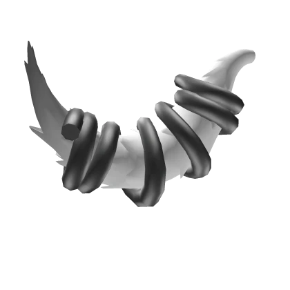
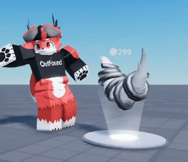
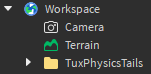
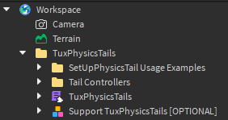
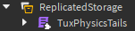
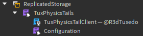

# Tux Physics Tails
Dynamic tail physics system for Roblox characters.

Created by [@R3dTuxedo](https://devforum.roblox.com/u/r3dtuxedo/summary)

Also featured on the [Roblox Developer Forum](https://devforum.roblox.com/t/POSTID) — join the discussion or share your feedback!

## Preview
<table>
  <tr>
    <td><strong>Global Wind</strong></td>
    <td><strong>Lots of Tails</strong></td>
  </tr>
  <tr>
    <td></td>
    <td></td>
  </tr>
  <tr>
    <td><strong>Tail Optimization</strong></td>
    <td><strong>Tail Controllers</strong></td>
  </tr>
  <tr>
    <td></td>
    <td></td>
  </tr>
</table>

## Features
- **Optimized for Performace** - Successfully computed 30,000 physics tails at 60 FPS in Studio without frame drop.
- **Smooth at Any Frame Rate** - Uses fixed timestep + linear interpolation for smoothness.
- **Customizable** - Easily configure the tail's stiffness and damping.
- **Scriptable Runtime Control** - Programmatically modify behaviours.
- **UGC Accessory Support** - Project's primary goal has been to work with tail accessories.
- **Custom Tail Support** - Works with non-accessory tails.
- **Custom Character Support** - Works with custom rigs and NPCs.
- **Dynamic Character Scaling** - Seamlessly handles changes in character scale.
- **Precedural Wag Animation** - Built-in idle wagging animation.
- **Character Forces** - Moves dynamically with character animations and movement.
- **Global Forces** - Reacts naturally to Roblox wind, gravity and custom global forces.

## Support the project
Support the project by purchasing **[Fluffy White Fox Tail of Elasticity.](https://www.roblox.com/catalog/96652730851999/Fluffy-White-Fox-Tail-of-Elasticity)**

There is also a `Support TuxPhysicsTails [OPTIONAL]` model included in the download:

Earn up to **~120 Robux per sale** when others purchase the accessory through your experience — [Learn more about affiliate sales](https://create.roblox.com/docs/en-us/monetize-avatar#:~:text=Affiliate%20(experience%20owner)%20receives%2040%25)

*(Accessory is included as an optional model to support the project — no setup required.)*

## Live Demo
Try it out in-game: [Tux Physics Tails Demo](https://www.roblox.com/games/87964558822302/Tux-Physics-Tails-3-0-0)

## How to Install
1. Download [tux-physics-tails-3.0.0.rbxm](https://raw.githubusercontent.com/R3dTuxedo/tux-physics-tails-v3/refs/heads/main/tux-physics-tails-3.0.0.rbxm).
2. Drag and drop the downloaded file into Roblox Studio.

You should see this:

3. Click the dropdown arrow.

4. Move the `TuxPhysicsTails` module to ReplicatedStorage.

Done!

*(Don't forget to credit @R3dTuxedo)*

## How to Use
### Configuration
If you would like to modify the stiffness, damping, etc., you can find the configuration module here:

There are scripting examples included in the download. If you would like to make custom tails see `SetUpPhysicsTail Usage Examples`. You can also check `Tail Controllers` for examples on controlling the tails with scripts.

# Download
[tux-physics-tails-3.0.0.rbxm](https://raw.githubusercontent.com/R3dTuxedo/tux-physics-tails-v3/refs/heads/main/tux-physics-tails-3.0.0.rbxm)

## License
This system is completely free to use.

**Just credit: `Tail physics created by @R3dTuxedo` in-game or in your game description.**

See [LICENSE](LICENSE) for details.
